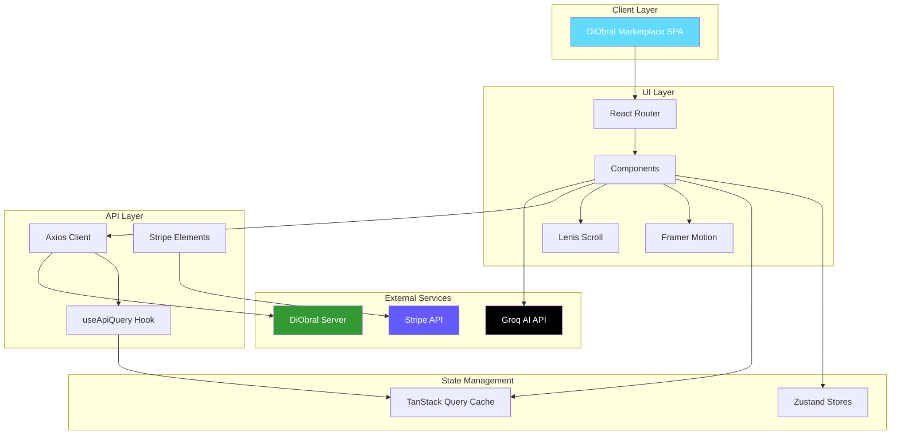
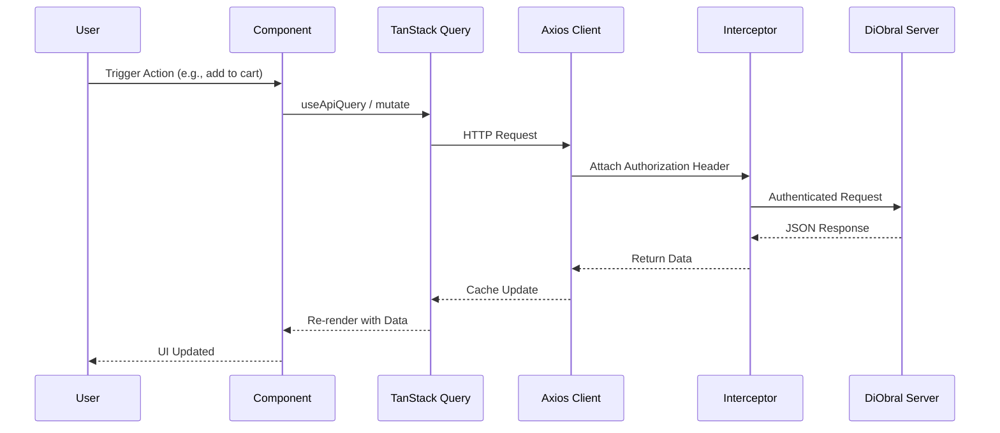
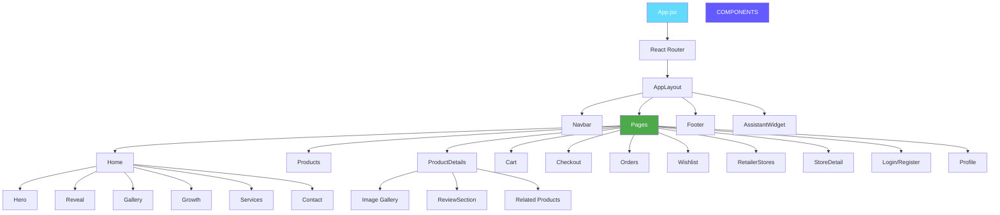

# DiObral Marketplace

[](package.json)
[](LICENSE)
[](#contributing)
[](#)

**Author:** [**Bazil Suhail**](https://github.com/BazilSuhail/)

---

## What is DiObral Marketplace?

**DiObral Marketplace** is a premium, multi-vendor e-commerce frontend built for the DiObral Online Marketplace. It provides a seamless, visually refined shopping experience where customers browse products, manage carts, place orders, track purchases, and interact with an AI-powered shopping assistant — all within a responsive, motion-rich interface.

> **DiObral** = *Digital* + *Obral* (Indonesian for "wholesale/market") — a digital marketplace built for scale, speed, and intelligent shopping.

> ### Mermaid Diagrams
> Head straight to the **[Architecture & Flows →](#mermaid-diagrams)** section at the very end of this README,
> or [click here to jump to the diagrams](#mermaid-diagrams).

---


## The Stack

[](https://react.dev/)
[](https://vitejs.dev/)
[](https://tailwindcss.com/)
[](https://reactrouter.com/)
[](https://tanstack.com/query)
[](https://zustand-demo.pmnd.rs/)
[](https://motion.dev/)
[](https://lenis.darkroom.engineering/)
[](https://stripe.com/)
[](https://oxc.rs/)
[](https://bun.sh/)

---

## Features

### Customer-Facing

| Feature | Description |
|---------|-------------|
| **Homepage** | Immersive hero, animated counters, partner logos, featured products, and testimonials |
| **Product Catalog** | Advanced filtering (price, category), sorting, grid/list views, debounced search, URL-synced filters |
| **Product Details** | Image gallery with navigation, size selector, quantity stepper, related products, full specs modal |
| **Shopping Cart** | Real-time quantity adjustments, automatic subtotal/discount/shipping calculations, hybrid persistence |
| **Checkout** | Multi-step secure checkout with shipping address and order confirmation |
| **Order Tracking** | View past orders, track status (pending → shipped → delivered), order grouping |
| **Wishlist** | Save favorite products across sessions, wishlist toggle with heart animation |
| **Follow Stores** | Follow preferred retailers for updates, follower count display |
| **Reviews & Ratings** | Submit star ratings and written feedback, aggregated metrics per product and store |
| **Bundles** | Purchase curated product bundles at discounted prices |
| **AI Shopping Assistant** | Voice/text agentic bot that searches products, manages cart, places orders, and answers questions |
| **Authentication** | Secure registration, login, profile management, role-based access |

### Retailer-Facing

| Feature | Description |
|---------|-------------|
| **Store Discovery** | Browse all stores, search by name, view storefronts with stats and products |
| **Store Detail** | Store hero, product grid, bundles, categories, store reviews, follow/unfollow |
| **Store Reviews** | Rate and review stores with aggregated metrics |

### Platform & UX

| Feature | Description |
|---------|-------------|
| **Responsive Design** | Mobile-first layout with adaptive UI components for all screen sizes |
| **Motion Design** | Framer Motion animations for page transitions, hover effects, modals, and skeleton loaders |
| **Smooth Scrolling** | Lenis smooth scroll integration for premium feel |
| **State Management** | Zustand stores for auth, cart, and wishlist with persistence |
| **Data Fetching** | TanStack Query for caching, background updates, and optimistic UI |
| **Search** | Debounced keyword search with URL-synced filters and shareable states |
| **Toast Notifications** | Non-intrusive feedback for user actions |

---

## Installation

```bash
# Clone the repository
git clone https://github.com/BazilSuhail/DiObral-Online-Marketplace.git
cd DiObral-Online-Marketplace

# Install dependencies
bun install
```

### Prerequisites

| Tool | Version |
|------|---------|
| **Node.js** | Latest LTS |
| **Bun** | 1.3+ |
| **DiObral Server** | Running at `http://localhost:3000` |

---

## Getting Started

### 1. Configure environment

```bash
cp .env.example .env
# Edit .env with your API base URL and other config
```

```env
VITE_API_BASE_URL=http://localhost:3000
```

### 2. Run the development server

```bash
bun run dev
```

Open [http://localhost:5173](http://localhost:5173) to view it in your browser.

### 3. Lint the codebase

```bash
bun run lint
```

---

## Tech Stack

| Technology | Purpose | Version |
|------------|---------|---------|
| **React** | UI Library | 19.3.0 |
| **Vite** | Build Tool & Dev Server | 8.3.2 |
| **Tailwind CSS** | Utility-First Styling | 4.3.3 |
| **React Router** | Client-Side Routing | 7.18.4 |
| **TanStack Query** | Data Fetching & Caching | 5.104.1 |
| **Zustand** | State Management | 5.0.15 |
| **Motion** | Animation Library | 12.43.0 |
| **Lenis** | Smooth Scrolling | 1.3.26 |
| **Axios** | HTTP Client | 1.20.0 |
| **React Icons** | Icon Library | 5.7.0 |
| **Stripe** | Payment UI | 9.17.0 / 6.12.0 |
| **Oxlint** | Linter | 1.86.0 |
| **Bun** | Package Manager | 1.3+ |
| **PostCSS** | CSS Processing | 8.5.28 |
| **Autoprefixer** | CSS Vendor Prefixes | 10.6.1 |

---

## Functionalities

### 1. Product Discovery & Browsing

- **Homepage**: Hero section, animated counters, partner logos, featured products, testimonials
- **Product Listing**: Grid/list view toggle, category filtering, price range slider, sorting, debounced search
- **URL-Synced Filters**: Shareable/bookmarkable search states via query parameters
- **Product Details**: Image gallery with thumbnails, size selector, quantity stepper, related products carousel

### 2. Shopping Experience

- **Cart Management**: Add/remove items, quantity adjustments, real-time totals, discount calculations
- **Checkout**: Multi-step form with shipping address, order summary, and confirmation
- **Payment**: Stripe Elements integration with payment intent flow
- **Order Tracking**: Order history with status badges, tracking numbers, and order grouping

### 3. User Accounts & Social

- **Authentication**: Register/login with JWT, session persistence via Zustand
- **Profile**: View and update profile information
- **Wishlist**: Save/unsave products, wishlist page with persistence
- **Follow Stores**: Follow/unfollow retailers, view followed stores
- **Reviews**: Submit product and store reviews with star ratings

### 4. Store Discovery

- **Store Listing**: Browse all stores with search and pagination
- **Store Detail**: Store hero, stats, product grid, bundles, categories, reviews
- **Follow System**: Follow stores, view follower counts

### 5. AI Shopping Assistant

- **Voice/Text Input**: Toggle between typing and voice transcription
- **Agentic Bot**: Groq-powered assistant with 10 tools for product search, cart management, and order placement
- **Modal Widget**: Persistent assistant panel that stays open during navigation
- **Session Persistence**: Chat history persisted in sessionStorage

### 6. Design & Animation

- **Framer Motion**: Page transitions, hover effects, modal animations, skeleton loaders
- **Lenis**: Smooth scrolling for premium feel
- **Responsive**: Mobile-first design with adaptive components
- **Skeleton Loaders**: Loading states for products, orders, and store details

---

## How It Works

### Routing

```
/ → Home
/about → About
/productlist/:urlCategory? → Product Listing
/products/:id → Product Details
/bundles → Bundle Listing
/bundles/:id → Bundle Details
/cart → Shopping Cart
/checkout → Checkout
/orders-tracking → Order History
/orders/:id → Order Detail
/signin → Login
/signup → Register
/profile → User Profile
/wishlist → Wishlist
/stores → Store Listing
/stores/:slug → Store Detail
/search → Redirects to /productlist/all
```

### State Management

- **Zustand Stores**: `authStore`, `cartStore`, `wishlistStore`
- **Persistence**: Auth and cart state persisted to localStorage
- **Server Sync**: Cart synced with backend for authenticated users

### Data Fetching

- **TanStack Query**: Centralized data fetching with caching, background refetching, and optimistic updates
- **Axios**: HTTP client with interceptors for auth tokens
- **API Adapter**: Custom hook `useApiQuery` wrapping TanStack Query for consistent error handling

### Authentication Flow

1. **Login/Register**: User submits credentials → backend returns JWT
2. **Token Storage**: JWT stored in Zustand + localStorage
3. **API Requests**: Axios interceptor attaches `Authorization: Bearer <token>` header
4. **Protected Routes**: Components check `isAuthenticated` from auth store
5. **Redirect**: Unauthenticated users redirected to `/signin`

### Checkout Flow

1. **Browse**: User views products via `/productlist/all`
2. **Cart**: Adds items to cart → persisted in Zustand + synced to backend
3. **Checkout**: User enters shipping address → order created on backend
4. **Payment**: Stripe payment intent created → user completes payment
5. **Confirmation**: Order confirmed → redirected to order tracking

---

## Pages & Routes

| Route | Page | Description |
|-------|------|-------------|
| `/` | Home | Hero, featured products, testimonials, partners |
| `/about` | About | About page |
| `/productlist/:urlCategory?` | Products | Product listing with filters |
| `/products/:id` | ProductDetails | Single product page |
| `/bundles` | Bundles | Bundle listing |
| `/bundles/:id` | BundleDetails | Single bundle page |
| `/cart` | Cart | Shopping cart |
| `/checkout` | Checkout | Multi-step checkout |
| `/orders-tracking` | Orders | Order history |
| `/orders/:id` | OrderDetail | Single order detail |
| `/signin` | LoginPage | User login |
| `/signup` | RegisterPage | User registration |
| `/profile` | Profile | User profile |
| `/wishlist` | Wishlist | Saved products |
| `/stores` | RetailerStores | Store listing |
| `/stores/:slug` | StoreDetail | Single store page |

---

## State Management

| Store | Purpose | Persistence |
|-------|---------|-------------|
| **authStore** | User authentication, token, profile | `localStorage` via Zustand persist |
| **cartStore** | Cart items, quantities, totals | `localStorage` + server sync |
| **wishlistStore** | Wishlist items, wishlist status | Server-fetched on auth |

---

## Project Structure

```
DiObral-Online-Marketplace/
├── public/
│   ├── diobral.webp
│   ├── logos/
│   └── placeholder.png
├── src/
│   ├── api/
│   │   ├── adapter.js          # useApiQuery hook (TanStack Query wrapper)
│   │   └── client.js           # Axios instance with interceptors
│   ├── components/
│   │   ├── assistant/          # AI Shopping Assistant widget
│   │   ├── cartModal/          # Cart slide-over modal
│   │   ├── checkout/           # Checkout form components
│   │   ├── homePage/           # Hero, Reveal, Growth, Services, Contact, Showcase
│   │   ├── layout/             # Navbar, Footer
│   │   ├── loaders/            # Skeleton loaders
│   │   ├── productReview/      # Review form and display
│   │   ├── searchModal/        # Search modal
│   │   └── ui/                 # Reusable UI components (Button, Badge)
│   ├── lib/
│   │   ├── assistantActions.js # Assistant action executor
│   │   ├── routeMeta.js        # Page meta tags
│   │   └── utils.js            # Utility functions
│   ├── pages/
│   │   ├── about/              # About page
│   │   ├── auth/               # Login, Register
│   │   ├── bundles/            # Bundle listing, details
│   │   ├── cart/               # Shopping cart
│   │   ├── checkout/           # Checkout flow
│   │   ├── home/               # Homepage
│   │   ├── orders/             # Order history, order detail
│   │   ├── products/           # Product listing, product details
│   │   ├── profile/            # User profile
│   │   ├── retailer-stores/    # Store listing, store detail
│   │   └── wishlist/           # Wishlist page
│   ├── store/
│   │   ├── authStore.js        # Auth state (Zustand)
│   │   ├── cartStore.js        # Cart state (Zustand)
│   │   └── wishlistStore.js    # Wishlist state (Zustand)
│   ├── App.jsx                 # Root component with routes
│   ├── main.jsx                # Entry point
│   └── index.css               # Global styles
├── .env                        # Environment variables
├── .gitignore
├── bun.lock
├── index.html
├── package.json
├── README.md
├── vite.config.js
└── netlify.toml
```

---

## Linting

This project uses **Oxlint** for fast, zero-config linting.

```bash
# Run linter
bun run lint
```

Oxlint is configured with built-in React and React Hooks rules. No ESLint config required.

---

## Contributing

Contributions are welcome! Open an issue or submit a pull request — by contributing, you agree to license your work under the same terms below.

---

## Author

**[Bazil Suhail](https://github.com/BazilSuhail/)** — [github.com/BazilSuhail](https://github.com/BazilSuhail/)

---

## License

This project is released under the **Bazil Suhail Hobby License v1.0** — see the [LICENSE](LICENSE) file for the full text.

| Allowed | Not Allowed |
|---------|-------------|
| Personal, hobby, learning & research use | Production deployment / serving real users |
| Copy, modify, and fork for non-commercial projects | Commercial, revenue-generating, or client work |
| Share publicly **with credit** to Bazil Suhail | Selling or reselling the Software as a product/service |

> **In short:** you are free to use DiObral Marketplace for fun, learning, and hobby projects — but **not in production or for profit** without prior written permission from **[Bazil Suhail](https://github.com/BazilSuhail/)**.

---

## Mermaid Diagrams

Jump back to the top: [Back to top](#diobral-marketplace)

### System Architecture



### Request Lifecycle



### Data Flow — Checkout

```mermaid
flowchart LR
    A[Browse Products] --> B[Add to Cart]
    B --> C[View Cart]
    C --> D[Proceed to Checkout]
    D --> E[Enter Shipping Address]
    E --> F[Create Order]
    F --> G[Stripe Payment Intent]
    G --> H[Complete Payment]
    H --> I[Order Confirmed]
    I --> J[Track Order]

    style A fill:#e1f5fe
    style I fill:#e8f5e9
    style J fill:#fff3e0
```



### Component Hierarchy



---

<p align="center">
  Built with <span style="color:#61DAFB">React</span> by the DiObral Team
</p>
